## En este apartado se vera como se crea una maquina virtual y dentro de ella se ejecuta otra maquina virtual
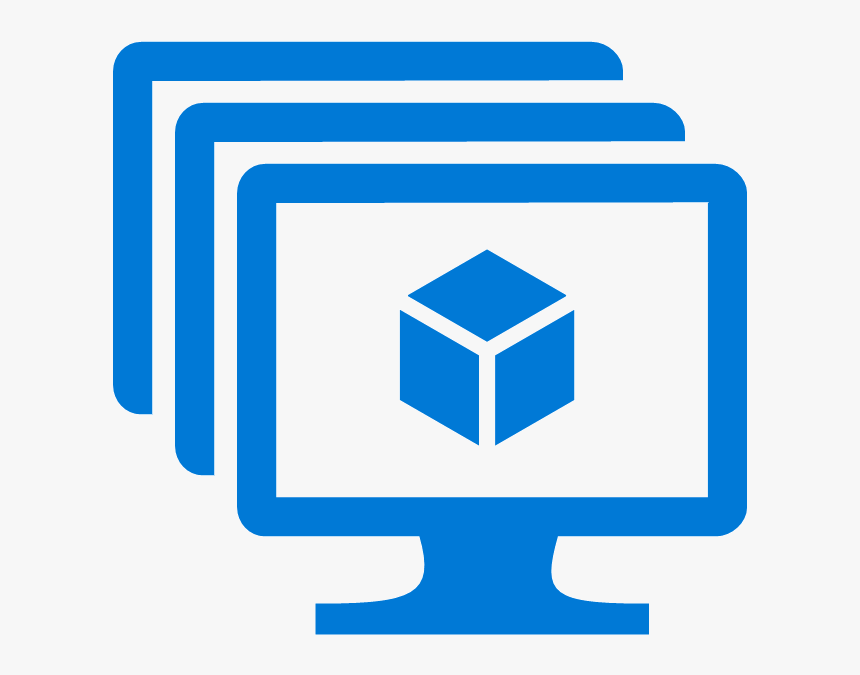
- Primero debemos ir a la pagina de [Portal azure](https://portal.azure.com/#home) donde podremos crear la maquina virtual y buscaremos el apartado de maquinas virtuales:
- Despues rellenamos todos los apartados que  nos pide dando como acceso solo el puerto de entrada RDP (3389) dejando un punto muy importante que es que la seguridad debe ser princial.
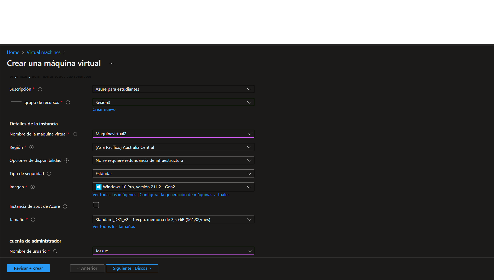
- Despues de llenar el fomulario debes crear otra maquina virtual del mismo modo
- Depues de que termine de crear las maquinas virtuales debe descargar desde la Microsoft Store la aplicación de escritorio remoto: 
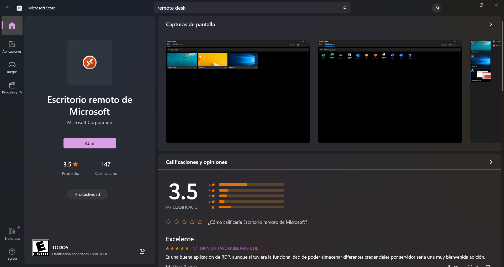
- Procedemos a descargar las maquinas virtuales que creamos (Abrimos la primer maquina virtual y nos conectamos a ella y descargamos donde dice Conet RPD) para abrirla desde la aplicacion que descargamos hace unos momentos
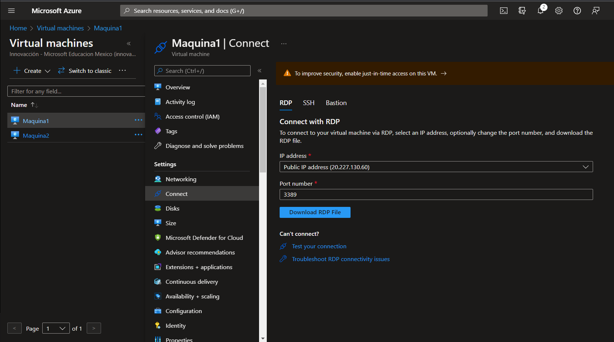
Al abrir la maquina virtual nos pedira que iniciemos sesion con la que creamos la maquina virtual.
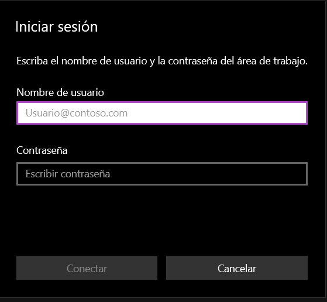
Al iniciar sesion automaticamente se iniciara la computadora virtual.
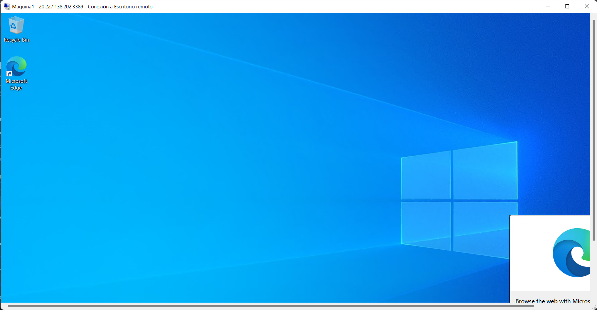
**Listo ya puedes empezar a usar tu maquina virtual**

#### Ahora procederemos a explicar como abrir una maquina virtual dentro de otra maquina virtual:

- Primero deberemos crear otra maquina virtual como la primera mirando bien que la ubiquemos en la misma hoja de recursos y en el misma area geografica 
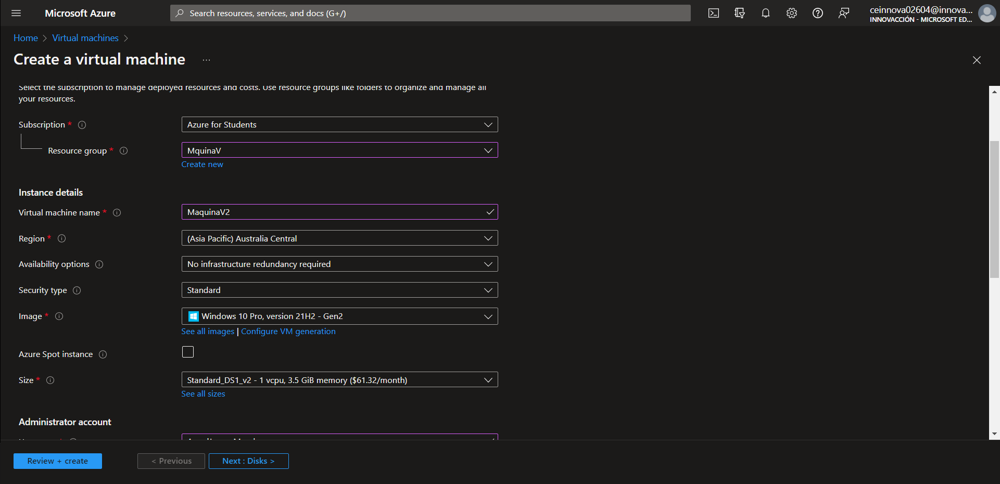
- Una ves lista la maquina virtual debemos descargarla de la misa manera que la primer maquina virtual (No abrirla)
- Ahora en la primera maquina virtual abierta debemos ir a powerShall y ejecutarlo como admistrador:
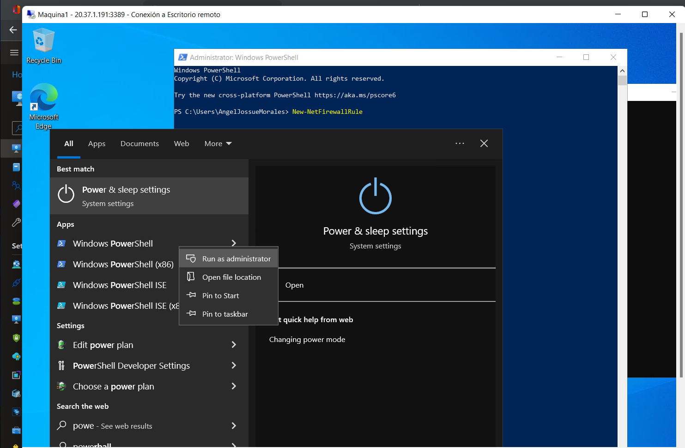
Esto es para poder vincular las 2 maquinas virtuales
- Una ves dentro de PowerShall ejecutaremos lo siguiente:
**New-NetFirewallRule -DisplayName "Allow ICMPv4-In" -Protocol ICMPv4**
Esto es para vincular las ip de las maquinas virtuales
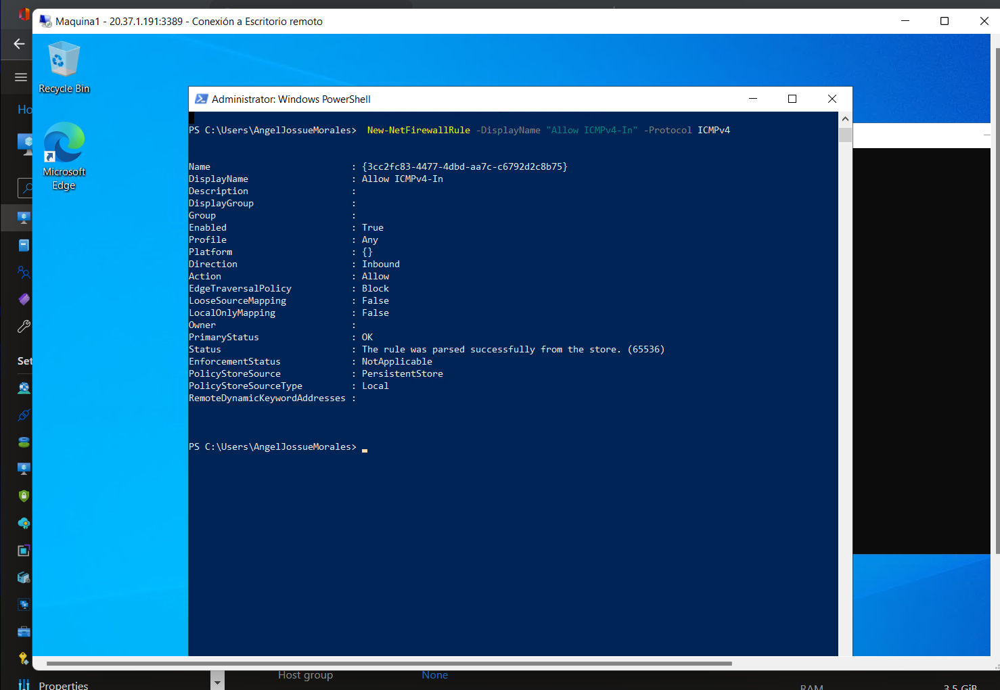
-Despues teclearemos el siguiente comando:
**mstsc /v:IP de tu maquina virtual**
Esto es para sincronizar la Ip de la maquina virtual 1 a la maquina virtual 2
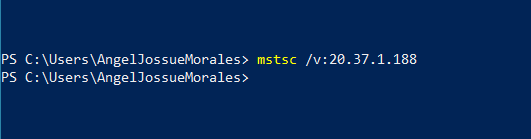
- Al ejecutar este comando automaticamente se te abrira una pestaña para iniciar sesion para la  maquina virtual numero 2
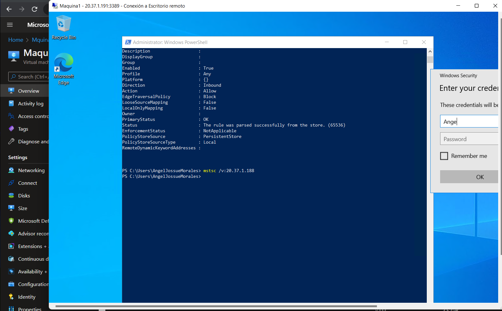
-Iniciamos sesion y listo hemos abierto una maquina virtual dentro de una maquina virtual :) 